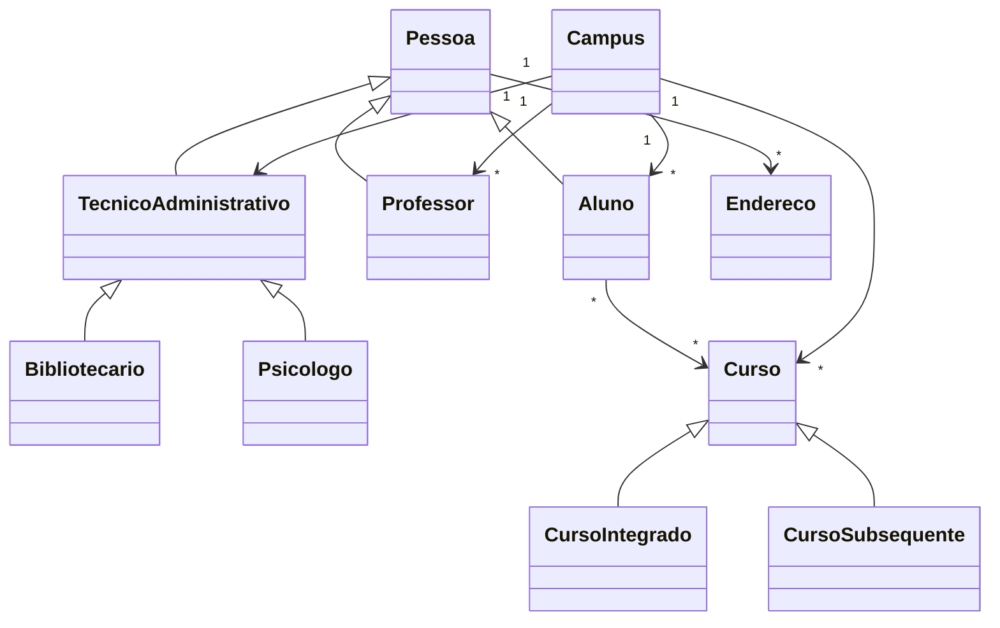

<div align="center">

# 📘 Programação Orientada a Objetos com TypeScript

Projeto acadêmico desenvolvido para praticar os principais conceitos da Programação Orientada a Objetos por meio da modelagem de uma instituição de ensino.


</div>

---

## 📌 Sobre o projeto

Este projeto foi desenvolvido para praticar Programação Orientada a Objetos utilizando TypeScript.

A aplicação representa, de forma simplificada, uma instituição de ensino composta por:

* campus;
* alunos;
* professores;
* técnicos administrativos;
* cursos;
* endereços;
* matrículas;
* relacionamentos entre entidades.

O objetivo principal é demonstrar como classes, herança, abstração, interfaces e relacionamentos entre objetos podem ser utilizados para modelar um domínio real.

---

## 🎯 Objetivos

O projeto busca praticar:

* criação de classes e objetos;
* encapsulamento;
* construtores;
* herança;
* polimorfismo;
* abstração;
* interfaces;
* composição;
* agregação;
* associação;
* modificadores de acesso;
* tipagem estática;
* organização modular;
* modelagem de domínio.

---

## 🧠 Domínio modelado

A aplicação representa uma estrutura acadêmica simples.

### Pessoa

Classe base utilizada por entidades que representam pessoas.

Exemplos:

* aluno;
* professor;
* técnico administrativo;
* bibliotecário;
* psicólogo.

### Aluno

Representa um estudante vinculado a um ou mais cursos.

Pode conter informações como:

* dados pessoais;
* endereços;
* matrícula;
* situação acadêmica;
* cursos associados.

### Professor

Representa um professor da instituição.

Pode conter:

* dados pessoais;
* matrícula;
* salário;
* campus de lotação.

### Técnico administrativo

Representa funcionários administrativos da instituição.

O projeto possui especializações como:

* bibliotecário;
* psicólogo.

### Curso

Classe abstrata utilizada como base para diferentes modalidades.

Especializações implementadas:

* curso integrado;
* curso subsequente.

### Campus

Representa uma unidade da instituição e mantém coleções de:

* alunos;
* professores;
* cursos ofertados;
* técnicos administrativos.

### Endereço

Representa os dados de localização utilizados por pessoas e campus.

---

## 🧩 Conceitos de POO aplicados

### Classes e objetos

As entidades do domínio são representadas por classes.

```typescript
const curso = new CursoSubsequente(
  "Informática",
  1200,
  true
);
```

### Encapsulamento

Os atributos são protegidos com modificadores de acesso e manipulados por getters e setters.

```typescript
private _nome: string = "";

public get nome(): string {
  return this._nome;
}

public set nome(value: string) {
  this._nome = value;
}
```

### Herança

Classes específicas reutilizam características de classes mais gerais.

```text
Pessoa
├── Aluno
├── Professor
└── Técnico Administrativo
    ├── Bibliotecário
    └── Psicólogo
```

Também existe herança entre cursos:

```text
Curso
├── Curso Integrado
└── Curso Subsequente
```

### Abstração

A classe `Curso` é utilizada como uma abstração para representar características comuns entre diferentes modalidades.

### Interface

Algumas entidades implementam contratos para padronizar determinados comportamentos.

### Associação

Objetos mantêm referências a outros objetos.

Exemplo:

* professor associado a um campus;
* aluno associado a cursos.

### Agregação

O campus agrupa alunos, professores, cursos e técnicos administrativos.

Esses objetos podem existir de forma independente do campus.

### Composição

Algumas entidades são formadas por outras estruturas, como pessoas que possuem endereços.

---

## 🔄 Relacionamentos principais



---

## 📁 Estrutura do projeto

```text
poo-typescript/
│
├── src/
│   ├── aluno/
│   │   └── aluno.ts
│   │
│   ├── campus/
│   │   └── campus.ts
│   │
│   ├── curso/
│   │   ├── curso.ts
│   │   ├── curso-integrado.ts
│   │   └── curso-subsequente.ts
│   │
│   ├── endereco/
│   │   └── endereco.ts
│   │
│   ├── pessoa/
│   │   └── pessoa.ts
│   │
│   ├── professor/
│   │   └── professor.ts
│   │
│   ├── projeto/
│   │   └── projeto.ts
│   │
│   ├── tecnico-administrativo/
│   │   ├── tecnico-administrativo.ts
│   │   ├── bibliotecario.ts
│   │   └── psicologo.ts
│   │
│   └── index.ts
│
├── package.json
├── tsconfig.json
└── README.md
```

---

## 🛠️ Tecnologias

| Tecnologia          | Aplicação                     |
| ------------------- | ----------------------------- |
| TypeScript          | Linguagem principal           |
| Node.js             | Execução do código compilado  |
| npm                 | Gerenciamento de dependências |
| TypeScript Compiler | Compilação para JavaScript    |
| Git                 | Controle de versão            |
| GitHub              | Hospedagem do projeto         |

---

## 🚀 Como executar

### Pré-requisitos

É necessário possuir:

* Node.js;
* npm;
* Git.

Verifique as versões:

```bash
node --version
npm --version
```

### Clone o repositório

```bash
git clone https://github.com/ONestoDev/poo-typescript.git
```

### Acesse a pasta

```bash
cd poo-typescript
```

### Instale as dependências

```bash
npm install
```

### Execute

```bash
npm start
```

O script executa:

```text
Compilação TypeScript
        ↓
Geração dos arquivos em dist/
        ↓
Execução de dist/index.js
```

---

## ⚙️ Configuração TypeScript

O projeto utiliza:

```text
src/  → código-fonte
dist/ → código compilado
```

As opções de compilação incluem:

* modo estrito;
* geração de source maps;
* arquivos de declaração;
* verificação de acesso inseguro a índices;
* detecção forçada de módulos.

---

## 🧪 Exemplo de execução

O arquivo principal cria:

* dois endereços;
* três cursos;
* um campus;
* dois professores;
* dois alunos;
* um bibliotecário;
* um psicólogo.

Depois, os objetos são adicionados ao campus e exibidos no terminal.

---

## ✅ Pontos fortes

O projeto demonstra:

* modelagem de um domínio real;
* aplicação prática dos pilares da POO;
* separação das classes por responsabilidade;
* uso de herança;
* uso de classes abstratas;
* relacionamentos entre objetos;
* coleções tipadas;
* encapsulamento;
* TypeScript em modo estrito.

---

## ⚠️ Limitações atuais

O projeto ainda apresenta algumas limitações:

* não possui testes automatizados;
* utiliza dados diretamente no `index.ts`;
* não possui validação robusta;
* não possui persistência;
* não possui interface gráfica;
* não possui tratamento de erros;
* não possui banco de dados;
* algumas propriedades podem aceitar valores inválidos;
* os dados de CPF são apenas exemplos fictícios;
* o código utiliza CommonJS e configurações de módulo que podem ser simplificadas.

---

## 🗺️ Melhorias futuras

* adicionar testes com Vitest ou Jest;
* criar validações de CPF e CEP;
* validar idade, salário e carga horária;
* substituir strings por enums;
* criar métodos de remoção;
* impedir cadastros duplicados;
* criar identificadores únicos;
* separar dados de demonstração;
* melhorar o tratamento de erros;
* adicionar persistência;
* documentar regras do domínio;
* configurar ESLint e Prettier.

---

## 🧪 Testes recomendados

| Cenário                            | Resultado esperado     |
| ---------------------------------- | ---------------------- |
| Criar aluno válido                 | Aluno criado           |
| Adicionar aluno ao campus          | Quantidade atualizada  |
| Adicionar o mesmo aluno duas vezes | Duplicidade rejeitada  |
| Criar curso com carga negativa     | Entrada rejeitada      |
| Criar pessoa com idade negativa    | Entrada rejeitada      |
| Adicionar professor                | Professor incluído     |
| Remover aluno                      | Quantidade recalculada |
| Curso sem nome                     | Entrada rejeitada      |

---

## 📚 Aprendizados desenvolvidos

Durante o projeto foram praticados:

* TypeScript;
* classes;
* objetos;
* herança;
* abstração;
* interfaces;
* encapsulamento;
* construtores;
* composição;
* agregação;
* associação;
* arrays de objetos;
* organização modular;
* modelagem de domínio.

---

## 🎓 Contexto educacional

Projeto desenvolvido durante estudos acadêmicos de Programação Orientada a Objetos.

A aplicação possui finalidade educacional e representa uma modelagem simplificada de uma instituição de ensino.

---

## 👨‍💻 Autor

Desenvolvido por **Ernesto — ONestoDev**.

[](https://github.com/ONestoDev)

---

## 📄 Licença

Defina uma única licença para o projeto e mantenha o `package.json`, o arquivo `LICENSE` e esta seção alinhados.
